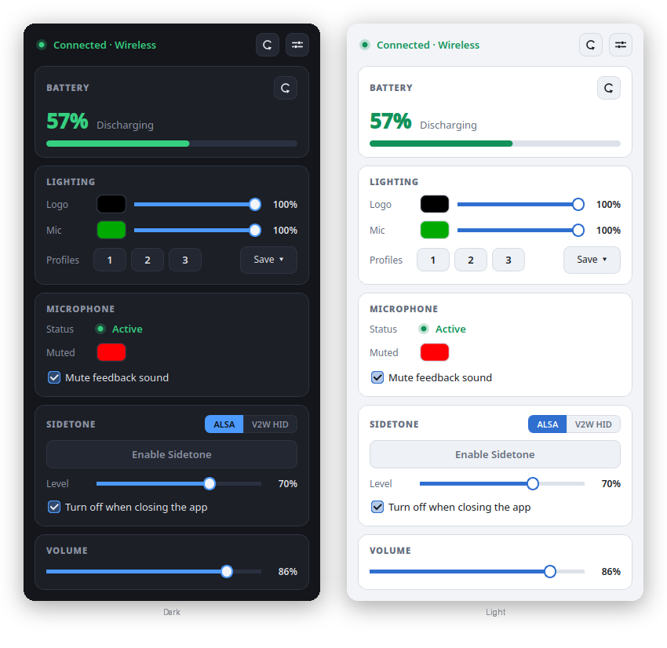

# Corsair Virtuoso SE Control for Linux

A lightweight, persistent, and native control panel for the Corsair Virtuoso SE/XT headset line on Linux, built by reverse-engineering the V2W HID protocol. It works with all Virtuoso models in both wireless dongle and wired USB modes.

> **Note:** This entire application was "vibecoded" from scratch by Alejandro Socas with the assistance and auditing of Google's Gemini AI agent. 



## Key Features

*   **Theme-Aware Interface:** The UI follows your desktop's light or dark preference automatically, and switches live if you change it — no restart needed. Everything is laid out as compact cards: connection status, a battery gauge, lighting, microphone, sidetone and volume.
*   **Accurate Battery Monitor:** Reads the actual battery level reliably, displaying stable percentages and charging status. Sends a desktop notification if the battery drops below 15%. Also, the physical hardware battery LED will accurately reflect its level (Green, Yellow, or Red)!
*   **Smart Battery Polling:** To prevent the headset from emitting annoying "reconnection beeps" when the battery is low (<15%), the application automatically suspends wireless battery polling until you connect the USB cable to charge.
*   **Dynamic Tray Icon:** The system tray icon acts as a live battery indicator, dynamically filling up and changing colors (Green, Yellow, Red, or Blue when charging) based on the headset's battery level.
*   **Full RGB Lighting & Profiles:** Control the exact color and brightness of both the side Logo and the Microphone LED through native color pickers (wireless mode only). You can save up to 3 custom **RGB Profiles** and switch between them instantly, either from the numbered buttons in the Lighting card or from the system tray context menu!
*   **Physical Mic-Mute Button:** The headset's own mute button keeps working. The app follows it, mutes the input, switches the mic LED to your chosen "muted" colour, and plays a feedback tone — with the current state shown in both the window and the tray.
*   **Dual-Mode Support (Wired / Dongle):** Automatically detects whether you are using the Wireless Dongle or connected directly via USB cable. The UI seamlessly adapts by disabling unsupported V2W wireless features in wired mode.
*   **Bilingual Support (English & Spanish):** Seamlessly switch the application language between English and Spanish directly from the Settings menu.
*   **Sidetone & Volume:** Independent control of sidetone and volume using native ALSA or direct V2W hardware commands.
*   **Universal Autostart (FreeDesktop):** Configure the app from the internal settings panel (the sliders button in the window header) to automatically start in the background every time you boot your PC (fully compatible with GNOME, KDE, XFCE, and any modern desktop).
*   **Start Minimized:** Option to launch the application directly into the system tray, keeping your screen clean.
*   **System Tray Integration:** Access all quick functions and the settings panel directly from your taskbar.
*   **Persistent Connection:** Keeps the HID session alive using a *heartbeat*, preventing unexpected device sleep disconnections (matching the behavior of the official Windows software).

## Prerequisites

The application requires `python3` and a few system dependencies.

### USB permissions (required for all methods)

```bash
sudo cp 99-corsair-virtuoso-hid.rules /etc/udev/rules.d/
sudo udevadm control --reload-rules && sudo udevadm trigger
```

You may need to **unplug and replug** the wireless dongle for the rules to take effect.

## Installation

### Option A: Using uv (recommended)

[uv](https://docs.astral.sh/uv/) handles Python dependencies automatically — no system packages needed.

```bash
git clone https://github.com/AlejandroSocas/VirtuosoControl.git
cd VirtuosoControl
uv run virtuoso-control
```

That's it — `uv` will create a virtual environment, install all dependencies, and launch the GUI.

### Option B: Using system packages

Install the dependencies via your system package manager:

```bash
# On Fedora/RHEL based systems:
sudo dnf install python3-pyqt6 python3-hidapi

# On Debian/Ubuntu based systems:
sudo apt install python3-pyqt6 python3-hidapi
```

Then run directly:
```bash
python3 virtuoso_gui.py
```

*(Make sure your user belongs to the `audio` group or equivalent if you want to use ALSA synchronization for Sidetone and Volume).*

### Option C: Automated system-wide installation

Run the installation script with superuser privileges (applies udev rules and copies files to `/opt/`):
```bash
sudo ./install.sh
```
Once finished, you can open **"Virtuoso Control"** directly from your operating system's application menu.

## Uninstallation

To completely remove the program and its permissions from your system, navigate to the downloaded folder and run:
```bash
sudo ./uninstall.sh
```

## Acknowledgments & Reverse Engineering
This project was born out of the necessity to control the Virtuoso SE on Linux without the battery draining quickly due to static LEDs. Through extensive Wireshark captures on Windows and the study of the V2W protocol, fully clean hexadecimal injection methods have been implemented for this specific dongle.
